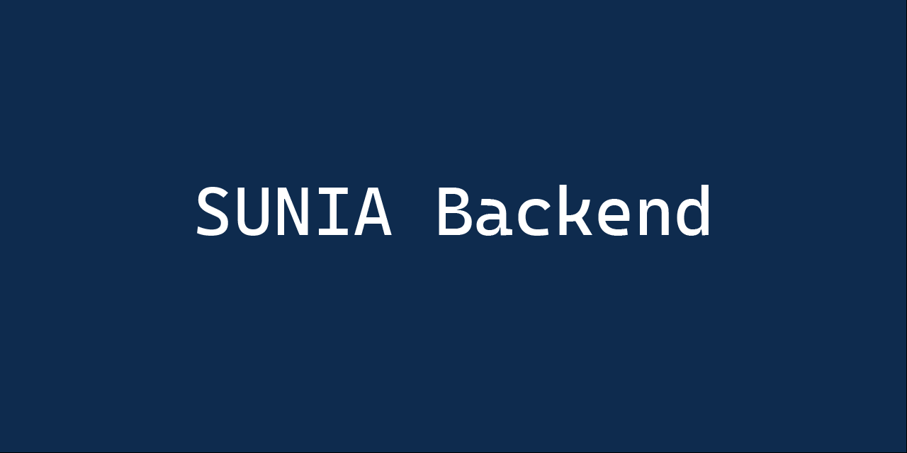
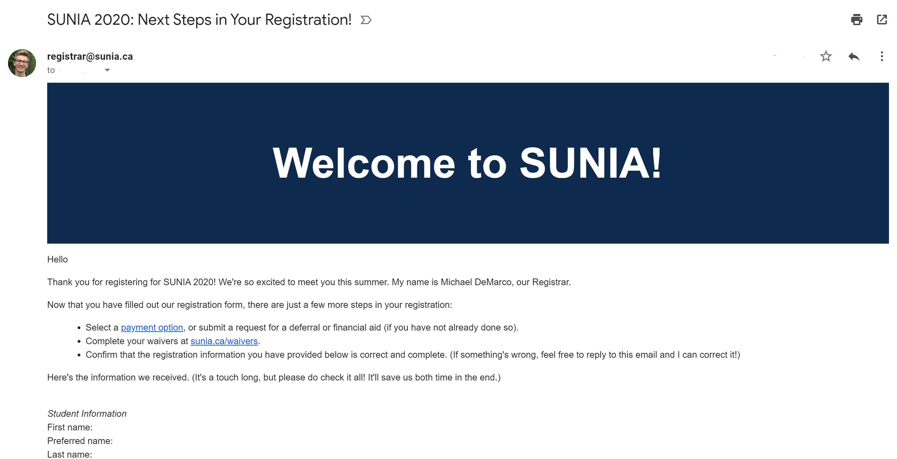
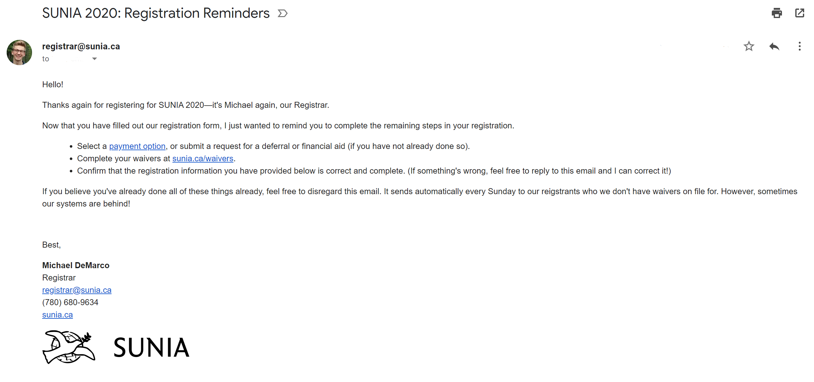

# SUNIA's Backend

SUNIA's backend, built using TypeScript and Google Apps Script through [clasp](https://github.com/google/clasp). Learn more about SUNIA [here](https://sunia.ca).

[](https://github.com/google/clasp)

<p align="center">
    
</p>

## About

SUNIA is a nonprofit summer program based in the Alberta Rockies. As a nonprofit, we looked to develop a *free* backend infrastructure to help us manage, contact, and organize our 150+ registrants annually. The code in this repository powers that.



### Directory

```python
┏╼╾.vscode # VS Code-specific project settings
╏   ┣╼╾settings.json # Any additional repository specific settings
┏╼╾node_modules # [GENERATED, IGNORED] Project dependencies for installed locally
╏   ┣╼╾...
┏╼╾src # The source code for the backend, written in TypeScript
╏  ┏╼╾html
╏  ╏    ┣╼╾intro-parents.html # An HTML email template for parents to welcome them to SUNIA (upon registration)
╏  ╏    ┣╼╾intro-students.html # An HTML email template for *students* to welcome them to SUNIA (upon registration)
╏  ╏    ┗╼╾reminder.html # An HTML email template to remind parents and students of steps they must take to complete their registration
╏  ┣╼╾.clasp.json # [GENERATED] The clasp configuration file
╏  ┣╼╾.claspignore # Files that should not be uploaded on `clasp push`
╏  ┣╼╾appsscript.json # [GENERATED] Google Apps Script settings, such as timezone
╏  ┣╼╾managePayments.ts # A script to transfer all payment details from "local" spreadsheets to master
╏  ┣╼╾newRegistration.ts # A script to contact a new registrant, and notify Slack
╏  ┣╼╾promoPoints.ts # A script to send an update for promo points
╏  ┣╼╾tsconfig.json # TypeScript configuration settings
╏  ┣╼╾weeklyReminders.ts # A script to send out a weekly reminder email
╏  ┗╼╾weeklyUpdate.ts # A script to gather and send a weekly update to staff
┏╼╾src-deprecated # Old JavaScript files that have been replaced, but are kept in case something badly breaks
╏   ┣╼╾ ...
┣╼╾.env # [IGNORED] A copy of the variables held in the Apps Script document
┣╼╾.gitattributes # A git helper file for normalizing CLRF and preventing a merge attempt of package-lock.json
┣╼╾.gitignore # Files which are not committed to GitHub
┣╼╾LICENSE # MIT License
┣╼╾package.json # An app containing project dependencies and other package information
┣╼╾package-lock.json # [GENERATED] A file to manage app dependencies
┗╼╾README.md # This file!
```

## Running it locally

### Requirements

- Node, NPM
- clasp
- *(Recommended)* VS Code
- An understanding of HTML, CSS, JavaScript, and TypeScript is beneficial

### Setup

- Run `npm install -g @google/clasp` to install clasp, Google's command line utility for working with Google Apps Script projects
- Run `npm i` to install project dependencies; the only dependency is types for clasp, so that IntelliSense in VS Code can function properly.
- Using Chrome, login to `registrar@sunia.ca`
- Run `clasp login` in the root directory; this should provide you a global `.clasprc.json` file
- Run `cd src` to move to the source folder, and run `clasp login` again, to give you a local project login
- Visit [this link](https://script.google.com/home/usersettings) and make sure the Google Apps Script API is turned on

### Adding the "environment variables"

This project needs to use a number of spreadsheet IDs that can be bit cumbersome to copy and paste throughout the code. As an alternative, they have referenced through Apps Script's equivalent to environment variables, script properties. They are also duplicated in a `.env` at the root directory. Here's an example:

```env
paypalSource="..."
chequeSource="..."
slackTestingWebhook="https://hooks.slack.com/services/..."
masterRegSource="..."
rawRegSource="..."
deferralSource="..."
aidSource="..."
```

In the actual Apps Script project, these are located under `File > Project properties > Script properties`.

## Usage

Clone a new clasp project
`clasp clone <scriptId>`

Pull the code for your current project; not needed for this project, given the use of TypeScript
`clasp pull`

Push your code to the source Google Apps Script project
`clasp push`

Open the Google Apps Script web editor
`clasp open`

Head to [the documentation](https://developers.google.com/apps-script/guides/clasp) for more.

## Development

Make any local changes and run `clasp push`. It's as easy as that.

If you want to have changes "auto save", you can run `clasp push --watch`.

## FAQ

### I'm having issues with clasp

Try this [Codelab](https://codelabs.developers.google.com/codelabs/clasp/#0) from Google—it takes a much more hands-on approach than this document and should provide you the needed foundations!

### There are many type errors; I'm having issues with TypeScript

Make sure you've run `npm install` to collect all needed types. The clasp documentation provides very useful steps for debugging common TypeScript issues, [here](https://github.com/google/clasp/blob/master/docs/typescript.md).

## Contributing

This project isn't currently looking for contributors at this time.

## SUNIA

Are you between the ages of 14 to 19 and interested in learning how to make a difference on the world around, but aren't sure where to start? SUNIA may be a fit for you! Learn more at [sunia.ca](https://sunia.ca). This could be an email you get soon enough!

